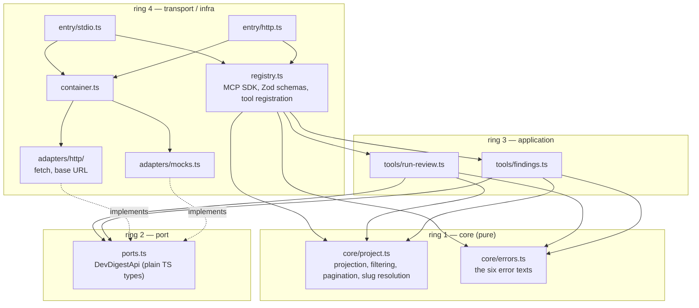

# `@devdigest/mcp` — the DevDigest MCP server

An MCP server exposing five tools over the DevDigest REST API, so a coding
agent (Claude Code, Claude Desktop) can list review agents, start a review,
read its findings, and read a repository's extracted conventions — without
knowing the API's ~50 flat routes. Spec: [`../specs/0011-mcp-server.md`](../specs/0011-mcp-server.md).

## What it is

Five tools, no `devdigest_` prefix (a client namespaces them itself):

| Tool | What it does |
|---|---|
| `list_review_agents` | List configured agents (model, provider, enabled/disabled). |
| `review_pull_request` | Start a review; returns a `run_id` per agent immediately (async). |
| `get_findings` | Read findings for one run or a whole pull request; paginated, concise by default. |
| `get_repo_conventions` | Read the house-style rules DevDigest extracted from a repo. |
| `get_blast_radius` | **Stub.** Registered but not implemented — every call returns an error naming the alternative. |

Two transports share one tool registry: **stdio** (primary — no port, no
Origin/Host surface) and **Streamable HTTP** (optional, for a client that
needs a URL instead of a subprocess).

This server has no database, no GitHub client, and never builds a `Container`
or calls the API's `buildApp()` — it is a thin `fetch` client over the running
DevDigest API (`server/`, `:3001` by default), the same way the studio web app
is. Authentication is out of scope (the API itself has none locally); the MCP
server inherits that posture.

## Deliberately NOT part of the dev scripts

`./scripts/dev.sh` and `./scripts/e2e.sh` do not install, build, or start this
package, and no CI workflow references it. That is on purpose: the MCP server is
a client-facing adapter you start when an agent needs it, not a component of the
running stack. `dev.sh`'s install step names its packages explicitly
(`install_if_needed server`, `client`, and a `reviewer-core` line — `dev.sh:76-80`),
so `mcp/` is never picked up implicitly.

**Keep it that way.** Do not add `mcp/` to `dev.sh`, `e2e.sh`, or a CI workflow.
Starting it costs nothing when idle but it needs the API already up, so folding
it into the stack launcher only creates a startup ordering problem and a process
nobody asked for.

Note what `.mcp.json` at the repo root does and does not do: it tells **Claude
Code** how to spawn this server over stdio when a session in this directory
connects — one short-lived subprocess per client, on demand. It does not make
`dev.sh` start anything. If you want zero automatic spawning, delete
`.mcp.json` and register the server only when you want it:

```bash
claude mcp add devdigest -e DEVDIGEST_API_BASE=http://localhost:3001 \
  -- ./mcp/node_modules/.bin/tsx ./mcp/src/entry/stdio.ts
```

## Run it from scratch

### 0. Prerequisites

| Need | Why |
|---|---|
| Node ≥ 22 | repo-wide baseline; the SDK needs ≥ 20, MCP Inspector ≥ 22.19 |
| Docker | only for Postgres, which the API needs — not for this package |
| An OpenRouter key in DevDigest settings | only if you intend to call `review_pull_request` (it spends money) |

This package has no database and no GitHub client. Steps 1-2 are independent:
you can install and smoke-test this server with **no API and no Postgres at all**
(step 3).

### 1. Start what it talks to — the API

The MCP server is a `fetch` client over the DevDigest REST API, so that has to be
up. You do **not** need the web app:

```bash
cd /path/to/dev-digest
./scripts/dev.sh --no-client     # Postgres + migrate + seed + API on :3001
```

Or fully manually, if you want to see each step:

```bash
docker compose up -d                       # Postgres 16 + pgvector
cd server && pnpm install && pnpm db:migrate && pnpm db:seed && pnpm dev
```

Confirm it is listening before going further:

```bash
curl -s localhost:3001/health            # -> {"status":"ok"} (200)
```

### 2. Install this package

Its own `package.json`, its own lockfile, **npm** (not pnpm — like
`reviewer-core/` and `e2e/`):

```bash
cd mcp
npm install
npm run typecheck                 # this is also the build: the package never emits JS
```

### 3. Smoke-test the protocol with no API (mock mode)

This proves the server speaks MCP and registers its tools, before any
API-related problem can confuse the picture:

```bash
npx @modelcontextprotocol/inspector@2 --cli ./node_modules/.bin/tsx src/entry/stdio.ts \
  -e DEVDIGEST_MCP_MOCK=1 \
  --method tools/list
```

Expect exactly five tools in this order: `list_review_agents`,
`review_pull_request`, `get_findings`, `get_repo_conventions`,
`get_blast_radius`.

> **`-e`, never a shell prefix.** The Inspector spawns the server with its own
> environment, so `DEVDIGEST_MCP_MOCK=1 npx …` is silently **ignored** and the
> call hits the real API instead. The giveaway is real agent uuids where the mock
> returns `agent-1`. Same trap for `DEVDIGEST_API_BASE`. See INSIGHTS.md
> (2026-09-27).

Two extra checks the Inspector gives you for free:

```bash
npx @modelcontextprotocol/inspector@2 --cli ./node_modules/.bin/tsx src/entry/stdio.ts \
  --method tools/list --strict          # schema-portability problems, non-zero exit if any
```

### 4. Call a tool against the live API

Read-only and free:

```bash
npx @modelcontextprotocol/inspector@2 --cli ./node_modules/.bin/tsx src/entry/stdio.ts \
  -e DEVDIGEST_API_BASE=http://localhost:3001 \
  --method tools/call --tool-name list_review_agents
```

Then a real query. `--tool-arg` takes `key=value`; repeat the flag for more:

```bash
# findings for a whole PR, CRITICAL only
… --method tools/call --tool-name get_findings \
  --tool-arg repo=acme/payments-api --tool-arg pull_number=482 --tool-arg severity=CRITICAL

# the stub — always an error, by design
… --method tools/call --tool-name get_blast_radius \
  --tool-arg repo=acme/payments-api --tool-arg pull_number=482
```

`review_pull_request` **spends money on LLM calls** and is rate-limited to 10
calls per minute. Omitting `agent` fans out to every enabled agent. It is
asynchronous: it returns a `run_id` per agent and you poll `get_findings` with
that id.

### 5. Wire it into a client

**Claude Code** — already covered by `.mcp.json` at the repo root; a session
started in this directory picks it up (project-scoped servers ask for approval
the first time). `.mcp.json` is read at session start, so **restart the session**
after adding or changing it. Or register it on demand with `claude mcp add` as
shown above.

**Anything that wants a URL instead of a subprocess** — the optional HTTP
transport:

```bash
npm run dev:http                  # http://127.0.0.1:3100/mcp
```

```bash
curl -s -X POST http://127.0.0.1:3100/mcp \
  -H 'Content-Type: application/json' \
  -H 'Accept: application/json, text/event-stream' \
  -d '{"jsonrpc":"2.0","id":1,"method":"tools/list"}'
```

Two things about that request, both verified:

- **`Accept` must list *both* types.** `Accept: application/json` alone is
  rejected with `-32000 Not Acceptable: Client must accept both application/json
  and text/event-stream`.
- **The reply is an SSE frame, not a JSON body** — `event: message` then
  `data: {…}`. Piping it straight into `jq` fails. Strip the prefix first:

```bash
curl -s -X POST http://127.0.0.1:3100/mcp \
  -H 'Content-Type: application/json' \
  -H 'Accept: application/json, text/event-stream' \
  -d '{"jsonrpc":"2.0","id":2,"method":"tools/call",
       "params":{"name":"list_review_agents","arguments":{}}}' \
  | sed -n 's/^data: //p' | jq -r '.result.content[0].text' | jq .
```

DNS-rebinding protection is on by default and accepts `127.0.0.1`, `localhost`
and `::1` only. Measured: a foreign `Host` header gets **403**, a foreign
`Origin` gets **403**, the normal request **200**. Binding wider means naming the
hosts explicitly — see `entry/http.ts`.

### Environment variables

| Variable | Default | Effect |
|---|---|---|
| `DEVDIGEST_API_BASE` | `http://localhost:3001` | Where the API is. The only file that reads it is `adapters/http/client.ts` |
| `DEVDIGEST_MCP_MOCK` | unset | `1` swaps in the in-memory `MockDevDigestApi` — no API, no network, deterministic |
| `PORT` | `3100` | HTTP entry only |

### Troubleshooting

| Symptom | Cause |
|---|---|
| `Cannot reach the DevDigest API at …` | The API is not running, or `DEVDIGEST_API_BASE` points elsewhere. Start it per step 1 |
| Env var appears ignored | Shell prefix instead of Inspector `-e` (see the callout in step 3) |
| A tool returns live data when you asked for the mock | Same cause. The mock's ids look like `agent-1` |
| Client connects but lists no tools | Check `tools/list` directly per step 3 — a client that sees no `capabilities.tools` may never ask |
| `EADDRINUSE` on 3100 | HTTP entry already running, or something else on that port. `PORT=3101 npm run dev:http` |
| Garbled JSON-RPC over stdio | Something wrote to **stdout**. stdout is the protocol channel here; all diagnostics must go to stderr |
| `Zod … requires ^4` on install | This package is Zod 4 by design; `server/` and `reviewer-core/` are Zod 3.25. Never share a `node_modules` between them |
| `get_findings` says a run is still executing | Correct behaviour — poll it, do not start another review |

## Architecture — rings

This package exists to keep the MCP SDK (and Zod 4 — `server/` and
`reviewer-core/` are pinned to Zod 3.25, and `@modelcontextprotocol/server@2.x`
requires Zod ≥ 4.2) out of the logic that decides *what* a tool call does.
Four rings, inner never imports outer:



- **The MCP SDK is imported only in `registry.ts` and `entry/*`.** Rings 1-3
  return plain data; wrapping into `{ content, isError }` happens in exactly
  one place.
- **`DevDigestApi` (ports.ts) has all five steps**: port → `adapters/http/`
  (real) → `adapters/mocks.ts` (deterministic, no network) → `container.ts`
  (composition) → consumed by `tools/*` and `registry.ts`.
- **No Middle Man.** `list_review_agents`, `get_repo_conventions` and
  `get_blast_radius` have no ring-3 module — the handler in `registry.ts`
  calls the port and pipes the result through a ring-1 projection directly.
  Only `review_pull_request` and `get_findings` have genuine multi-step
  orchestration (slug → repo id → pull id → start; run → findings + status),
  so only they get a `tools/*.ts` file.
- **The token budget is ring 1.** `response_format` projection,
  severity/category filtering, truncation and pagination are pure functions —
  see `core/project.ts` and its tests.

Full ring table, boundaries and conventions: [AGENTS.md](AGENTS.md).

## Enforcement

`npm run lint` runs ESLint (`no-restricted-imports`/`no-restricted-globals`
zones for the MCP SDK, Zod and `fetch`) and then `npm run arch`
(`.dependency-cruiser.cjs` — SDK confinement, no Zod in rings 1-3, no cycles).
`fetch`-confinement to `adapters/http/` is ESLint-only: dependency-cruiser only
sees imports, and `fetch` is a global.

## The one server dependency

`get_findings` (by `run_id`) needs `GET /runs/:id/findings` — a new server
route (spec 0011, built alongside this package by a different agent, not by
this one). Its confirmed contract (`server/src/vendor/shared/contracts/findings.ts`):
`{ findings, status, next_cursor }`, `severity`/`category` as repeated query
params, `limit` defaulting to 20. Critically, this response carries **only**
the polled run's own status — no pull id, no sibling-run information. Spec
0011's "still executing" error text ("2 of 3 agents done") is therefore only
buildable when `get_findings` was called with `repo`+`pull_number` (there the
pull id is known, so `GET /pulls/:id/runs` — already existing — can count the
batch); the `run_id` path omits that clause. See `core/errors.ts`'s
`StillRunningInfo` and `tools/findings.ts` for the two-variant handling, and
`adapters/http/index.ts` for the wire mapping.

## Testing

`npm test` (vitest): ring-1 projection units (concise vs detailed, severity
filter, truncation, pagination — no network, no SDK); all five tools driven
through `MockDevDigestApi` (no network); `get_blast_radius` asserting
`isError: true`; one test per error text; a token-budget ceiling on the
serialised tool definitions; and a determinism check on `tools/list` ordering.
