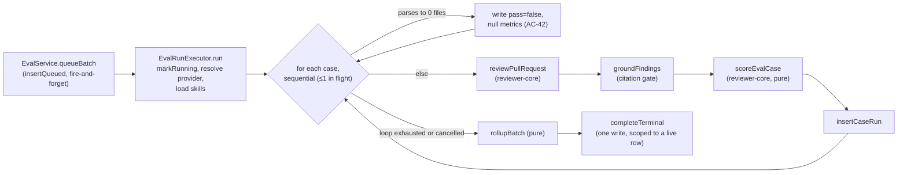

# Evals

The batch-run backend for spec [`0019-evals.md`](../../specs/0019-evals.md) (done). Scoring itself
lives in `reviewer-core` — [`reviewer-core/docs/eval-scoring.md`](../../reviewer-core/docs/eval-scoring.md).
The UI is [`client/docs/evals-ui.md`](../../client/docs/evals-ui.md). The Eval Dashboard, trend
charts, the compare modal, the manual Case Editor and skill-owned cases are **not** built — that is
spec 0020.

## Schema

Migration `0022_chemical_harrier.sql` (`server/src/db/migrations/0022_chemical_harrier.sql:1-23`)
adds five `NOT NULL` columns with no `DEFAULT` to `eval_cases`
(`expectation_kind`, `expected_file`, `expected_start_line`, `expected_end_line`, plus the nullable
`source_finding_id` and `created_at`), the new parent table `eval_run_batches`, and `eval_runs.batch_id`
(`server/src/db/schema/eval.ts:38-145`). Two partial unique indexes do the enforcement a read-then-write
guard alone could not:

- `eval_cases_owner_source_uq` on `(owner_id, source_finding_id) WHERE source_finding_id IS NOT NULL`
  (`eval.ts:67-76`) — a double-click or page reload on the same finding gets a `409`, not a second row.
- `eval_run_batches_owner_live_uq` on `(owner_id) WHERE status IN ('queued','running')`
  (`eval.ts:117-124`) — two concurrent `POST /agents/:id/eval-runs` cannot both create a live batch;
  the loser's insert fails at the database and the route maps that to the same `409 conflict` its own
  service-level check already returns.

`expectation_kind` is a Drizzle `text(col, { enum })`, which narrows the TypeScript type only — there
is no Postgres `CHECK`, so a raw insert of an unknown kind round-trips verbatim.

Both `cost_usd` columns are `numeric(12,6)`; the four ratio columns (`recall`, `precision`,
`citation_accuracy`, plus `eval_runs`' own copies) stay `doublePrecision`. Drizzle 0.38's `numeric()`
has no `mode: 'number'`, so `cost_usd` crosses the repository boundary as a **string** —
`Number()` on read, `String()` on write — in both `eval-batch.repo.ts` and the DTO mappers
(`server/src/modules/evals/repository/eval-batch.repo.ts:107-121,185-201`,
`server/src/modules/evals/helpers.ts:111,127`).

## Module layout

```
server/src/modules/evals/
  routes.ts              transport only — Zod contracts, getContext, no drizzle
  service.ts              EvalService — case creation, batch lifecycle, reap
  run-executor.ts          EvalRunExecutor — the background sweep
  helpers.ts               pure: rollupBatch, row → DTO mappers
  constants.ts             EVAL_TASK_LINE, EVAL_REAP_ERROR
  repository/
    eval-case.repo.ts      the only file here allowed to import drizzle for cases
    eval-batch.repo.ts      ditto for batches/runs
```

## Why a new executor instead of `ReviewRunExecutor`

`EvalRunExecutor.run()` (`server/src/modules/evals/run-executor.ts:51-262`) is modelled on
`ReviewRunExecutor.runOneAgent` but duplicates its provider/skills resolution block rather than
reusing it. `ReviewRunExecutor` is coupled to a real `PullRow` through `loadDiff`
(`server/src/modules/reviews/diff-loader.ts:12-19`) and to `agent_runs` persistence; an eval case
carries its own stored diff (`eval_cases.input_diff`) and has no PR row to persist against. The
duplication was an accepted cost, not an oversight.

**Where `loadDiff` may and may not be imported** is enforced by file, not by directory:
`evals/service.ts` imports it for case creation only (`service.ts:8`, snapshotting the diff once at
`POST /eval-cases` time); `run-executor.ts` imports neither it nor `reviews/run-executor.ts`
(`run-executor.ts:1-10`). `server/test/evals-imports.test.ts` pins both halves with a static
import-graph assertion, including a positive control that fails if the evals module stopped reaching
any diff loader at all.

## The run pipeline



Scoring runs against the **grounded** findings only (`outcome.review.findings`), never raw model
output (`run-executor.ts:169-181`); `kept` is that same grounded list's length and `dropped` is
`outcome.dropped.length` (`run-executor.ts:178-180`) — `ReviewOutcome.review.findings` already *is*
the survivor set, so no extra grounding call is needed here.

## Batch rollup and the null-cost rule

`rollupBatch` (`server/src/modules/evals/helpers.ts:61-71`) is pure: the three ratios are the
unweighted mean over cases whose metric is non-null (`meanNonNull`, `helpers.ts:37-41`), `cases_passed`
counts `pass === true`, and `cost_usd` is a **decimal** sum — every cost scaled to an integer at 6
decimal places, summed as integers, divided back once (`sumCostUsd`, `helpers.ts:50-54`) — never a
`+=` on floats. If *any* case's `cost_usd` is `null`, the whole batch's `cost_usd` is `null`, not a
partial sum (`helpers.ts:51`): one unpriced model makes the run's cost unknown, not smaller. A case
that failed before any model call (a diff that parsed to zero files, or a thrown error) contributes
`costUsd: null` to the rollup (`run-executor.ts:149,223`), so one dead case nulls the whole batch's
cost tile — the executor never invents a `0`.

## One terminal status, enforced in the database

`EvalRunExecutor` always reaches exactly one of `done`, `failed`, `cancelled` after `queued` →
`running`, and writes that terminal row exactly once (`run-executor.ts:227-239`). Control flow alone
could not guarantee this: the executor's own catch-all runs `runLog.result(...)` and other code
*after* `completeTerminal` has already written `done` inside the same `try`, so a throw there would
reach the catch-all and silently overwrite a `done` row to `failed`, losing the rollup. Both terminal
writers — `completeTerminal` and `failImmediately` — are therefore scoped to a still-live row
(`WHERE status IN ('queued','running')`, `eval-batch.repo.ts:107-121,130-135`), so a second terminal
write is a no-op rather than an overwrite.

## Cancellation

`POST /eval-runs/:batchId/cancel` (`routes.ts:89-97`) signals through the same
`container.runBus.registerAbort`/`cancel` pair `ReviewRunExecutor` uses
(`server/src/platform/sse.ts:53-67`); cancelling a batch with nothing in flight is a silent no-op,
never a throw. The executor checks `runBus.isCancelled(batchId)` **before** starting each case
(`run-executor.ts:133-136`), so a signalled cancellation starts no further case and keeps every row
already written. Abort only stops the loop between cases and aborts an in-flight provider call only
on a provider that honours `AbortSignal` (inherited from `reviewPullRequest`,
`reviewer-core/src/review/run.ts`).

## Boot reap: why it needs two criteria

`EvalService.reapOrphanedBatches()` (`service.ts:191-193`) delegates to
`EvalBatchRepository.failOrphaned()` (`eval-batch.repo.ts:208-215`), which fails every still-`queued`/
`running` batch with `EVAL_REAP_ERROR` (`constants.ts:15`). `app.ts` calls it inside the **existing**
`if (config.nodeEnv !== 'test')` boot block, alongside `reapOrphanedRuns()`, `reapOrphanedJobs()` and
`OnboardingRepository.reapRunning()` (`server/src/app.ts:102-120`). The skip is load-bearing, not
incidental: `loadConfig` reads `databaseUrl` from the ambient environment with no test override, so a
test boot would reap the **developer's own database**. The consequence: no automated test can exercise
the wiring at `app.ts:120` itself — only the method in isolation (`server/test/evals-reap.it.test.ts`).
The spec's own test plan says so explicitly and settles for reading the line plus a manual restart
walk; that manual walk was **not performed** before `status: done` was set (see `## Not documented`).

## Reusing the review SSE route

No new SSE route exists for batch progress. `GET /runs/:id/events`
(`server/src/modules/reviews/routes.ts:65-120`) subscribes by id with **no database lookup** —
`await getContext(container, req)` only establishes the caller's workspace, and `container.runBus.subscribe(runId, …)`
takes whatever id string arrives — so a batch id streams through it unchanged. `EvalRunExecutor`
publishes through the same `RunLogger`, keyed by the batch id (`run-executor.ts:56-59`), and calls
`runBus.complete(batchId)` in its `finally` to end the generator (`run-executor.ts:259`).

A batch therefore inherits the route's 512-event backpressure cap and its
`reply.raw.on('close', …)` wake (`reviews/routes.ts:27,107-112`) — and also its scoping gap: the
route is **not workspace-scoped** to the batch id, since there is no DB row to check it against. That
is harmless only because the product has one workspace and no per-user roles today; it is a known
residual recorded during review, not a fix.

## Spend guard

`POST /agents/:id/eval-runs` carries the same per-route rate limit as `POST /pulls/:id/review`
(`{ max: 10, timeWindow: '1 minute' }`, `routes.ts:66-75`) — both are the paid-LLM routes. There is no
cap on `cases_total` itself: an operator can start an N-case sweep of any size; the only guards are
informational (the client-side confirmation naming N, and the previous batch's `cost_usd`) plus the
ability to cancel a running sweep.

## Not documented

- **The manual walks in the spec's own test plan were never performed** — turning a seeded finding
  into a case and watching precision fall after a sloppy prompt edit, and the restart walk that is
  the only exercise the boot reap (`app.ts:120`) can ever get. Both remain described-but-unexercised.
- **Two recorded test-coverage gaps, not behaviour gaps:** the spec's own Completion phase notes that
  AC-45's "at most one case in flight" assertion is unfalsifiable as written, and that the terminal-
  write guard's unit test still passes if its `WHERE status IN (...)` predicate's `and` were replaced
  by an `or`. The *code* itself is a plain sequential `for` loop with no concurrency
  (`run-executor.ts:130-151`) and a `WHERE ... AND ...` clause (`eval-batch.repo.ts:120`,`134`) — read-
  verified here — but neither claim is pinned by a test that would fail if the behaviour regressed.
- **This diagram is unrendered** — no local Mermaid renderer (`mmdc`) was reachable in this
  environment to confirm it parses; it was kept small and syntactically plain for that reason.
