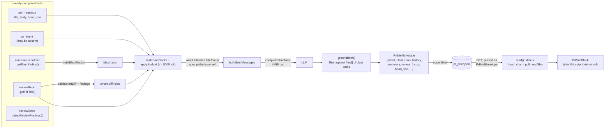

# PR Brief: generation

Shipped by spec [0018](../../specs/0018-pr-brief.md) (commits `ad877b5`, `6614db5`). One grounded
model call, over facts the server already computed for other features, produces the summary, risk
list and reading order shown at the top of the Overview tab.

## The pipeline



`BriefService.generate` (`src/modules/brief/service.ts:49-199`) is the whole right-hand side of
that diagram; `BriefService.read` (`:39-47`) is the bottom loop, and makes no LLM call (AC-20).

## No diff hunk body reaches the model

The facts sent are `files[].path/additions/deletions`, never `.patch`
(`src/modules/brief/service.ts:105-113,141-144`) — a fixture's patch line is asserted absent from
every prompt message in `test/brief.prompt.test.ts`.

## Budget: drop whole blocks, not characters

`buildFactBlocks` builds six **droppable** blocks; `intent`, the PR title and the blast `summary`
string are counted as fixed overhead and never dropped (`src/modules/brief/helpers.ts:99-143`).
Over 8 000 tokens (`BRIEF_INPUT_TOKEN_BUDGET`, `src/modules/brief/constants.ts:12`), `applyBudget`
removes whole blocks lowest-value-first in the fixed order `specs → smart_diff → blast_callers →
issue → pr_body → diff_stats` (`constants.ts:28-36`), and each drop becomes a `missing_inputs[]`
entry (`service.ts:131`). A truncated character count would read as a cut-off sentence; a dropped
block reads as a stated absence instead.

## The envelope's shape is a deliberate overflow, not a snapshot format

`PrBrief` (`src/vendor/shared/contracts/brief.ts:148-156`) requires `intent`, `blast`, `risks` and
`history` — all four, unconditionally. The stored `pr_brief.json` is **that same schema**, plus six
transport fields bolted on with `.extend()`:

```ts
// src/vendor/shared/contracts/review-api.ts:165-171
export const PrBriefEnvelope = PrBrief.extend({
  head_sha: z.string(),
  generated_at: z.string(),
  model: z.string(),
  missing_inputs: z.array(MissingInput),
});
```

This works for exactly one reason: **Zod strips unknown keys by default.** `PrBrief.parse()` on an
object carrying `head_sha`/`generated_at`/`model`/`missing_inputs` succeeds and silently drops
those four keys rather than rejecting the object — `test/contracts.test.ts:456-469` pins this
behaviour under the name `PrBrief.parse() strips unknown keys rather than rejecting them (C3)`,
specifically because the feature's own envelope is the object being parsed in that test. The read
path depends on the same fact in the other direction: `BriefRepository.getBrief` parses the stored
row through `PrBriefEnvelope`, never the bare `PrBrief` (`repository/brief.repo.ts:7-29`) — parsing
through `PrBrief` would strip `head_sha` and the staleness check in `read()` would have nothing to
compare against.

**If `PrBrief` ever gains `.strict()`, this breaks silently.** No runtime error until the *write*
path (`service.ts:184`'s `upsertBrief`, which validates via `PrBriefEnvelope` and would start
throwing) — but the far more dangerous failure is `PrBrief.parse()` calls elsewhere in the codebase
that currently succeed on brief-shaped data and would start rejecting it the moment the schema adds
`.strict()`. There is exactly one `.strict()` schema in either contracts package today
(`SettingsUpdate`, `src/vendor/shared/contracts/platform.ts:118`), so the pattern is in-repo and
imitable — which is why it is written down here rather than left to be rediscovered.

`history` is always written as `{ history: [] }` (`service.ts:175`): the field is required by
`PrBrief` so the envelope must carry it, and nothing in this feature computes a real value — no
code path populates `PrHistory` anywhere in `server/src`.

## Grounding: every model-named path is checked before the write

`groundingPaths` (`helpers.ts:34-46`) is the union of the PR's own `files[].path` and every path in
the blast map (changed-symbol files, downstream files, caller files). `groundBrief` (`:62-88`) then:
- drops a `review_focus` item whose `file` isn't in that set, or whose `line < 1`;
- strips an ungrounded entry from a risk's `file_refs`, and drops the risk entirely if that empties
  it.

Comparison normalises one leading `./` and collapses repeated `/`, case-sensitively thereafter
(`normalizePath`, `:22-25`). This runs **before** `upsertBrief` (`service.ts:167-184`), so no
persisted envelope can carry a path the model invented.

## Cross-module access: pure helpers and container ports only, never a sibling service

`src/modules/brief/service.ts` imports `buildBlastRadius` from `../blast/helpers.js` and
`buildSmartDiff` from `../smart-diff/helpers.js` (`:6-7`) — never `BlastService` or
`SmartDiffService`. `no-cross-module-internals` (`.dependency-cruiser.cjs:88-97`, `severity:
'error'`) matches any import of a sibling module's `service.ts` or `repository/**`, and
`tsPreCompilationDeps: true` (`:149`) makes even a type-only import trip it. `helpers.ts` is
outside the rule's `to.path`, which is why the pure-function split exists at all rather than being
a style preference. During implementation this was proven to actually fire, not just pass: a
deliberate `import { SmartDiffService } from '../smart-diff/service.js'` was added to
`service.ts`, `pnpm arch` was confirmed to error, and the import was reverted — recorded in the
spec's Implementation phase (`specs/0018-pr-brief.md:550`).

## Failure and caching

A model failure or a `BRIEF_TIMEOUT_MS` (60 000 ms, `constants.ts:8`) timeout is rethrown as
`ExternalServiceError` (`service.ts:160-165`), which `app.ts` turns into a 502 — not the 500 a bare
`Error` would produce. `GET /pulls/:id/brief` never calls the model (`read()`, `service.ts:39-47`);
it returns the cached envelope with `stale: true` when the stored `head_sha` no longer matches the
pull's current head, so opening a PR page is always free and regeneration is always an explicit
`POST`.

## Where to look

| Concern | File |
|---|---|
| Orchestration, envelope assembly, the one model call | `src/modules/brief/service.ts` |
| Budget and grounding (pure, unit-testable without Postgres) | `src/modules/brief/helpers.ts` |
| Prompt assembly and untrusted-input wrapping | `src/modules/brief/prompt.ts` |
| Timeouts, caps, truncation order | `src/modules/brief/constants.ts` |
| Transport | `src/modules/brief/routes.ts` |
| Persistence, parsed through `PrBriefEnvelope` | `src/modules/brief/repository/brief.repo.ts` |
| Contracts | `src/vendor/shared/contracts/brief.ts`, `src/vendor/shared/contracts/review-api.ts:155-178` |
| Client rendering | [`client/docs/pr-brief-ui.md`](../../client/docs/pr-brief-ui.md) |
